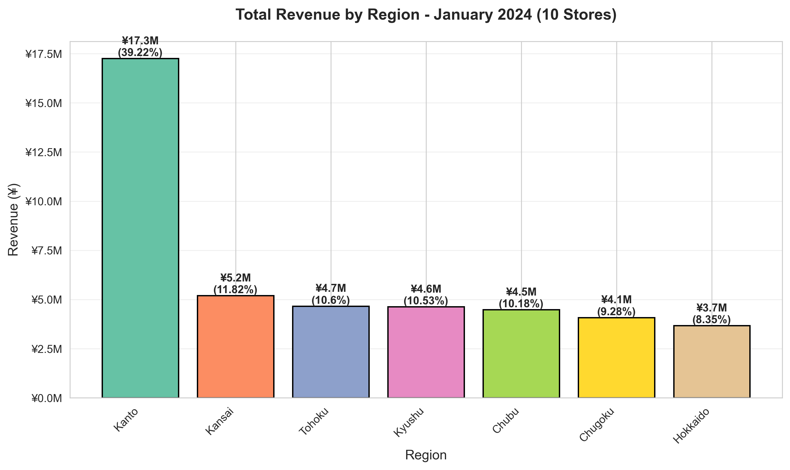
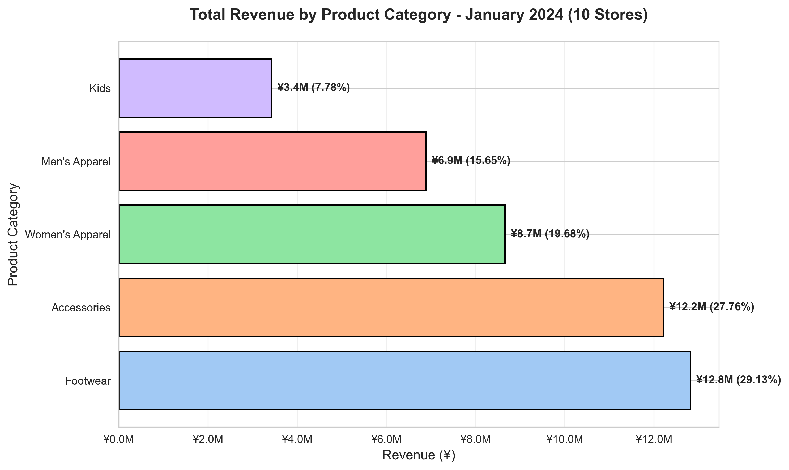
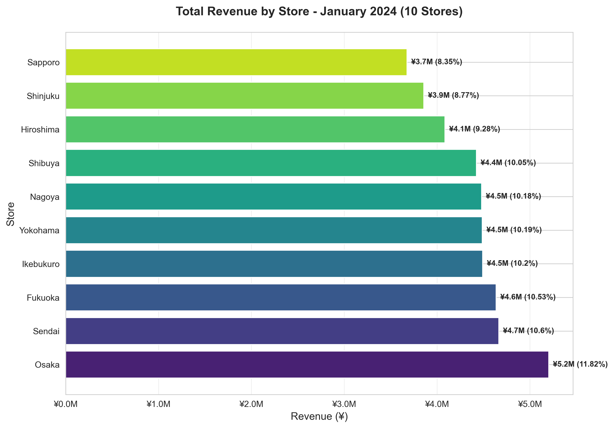
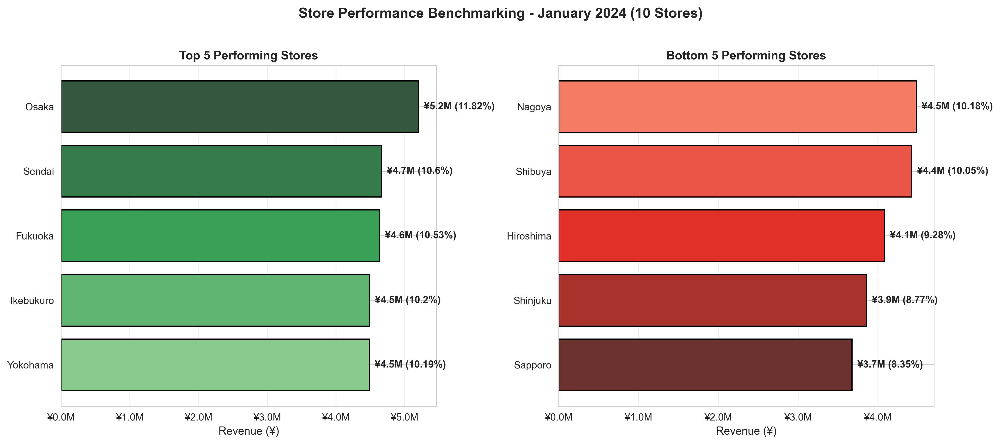
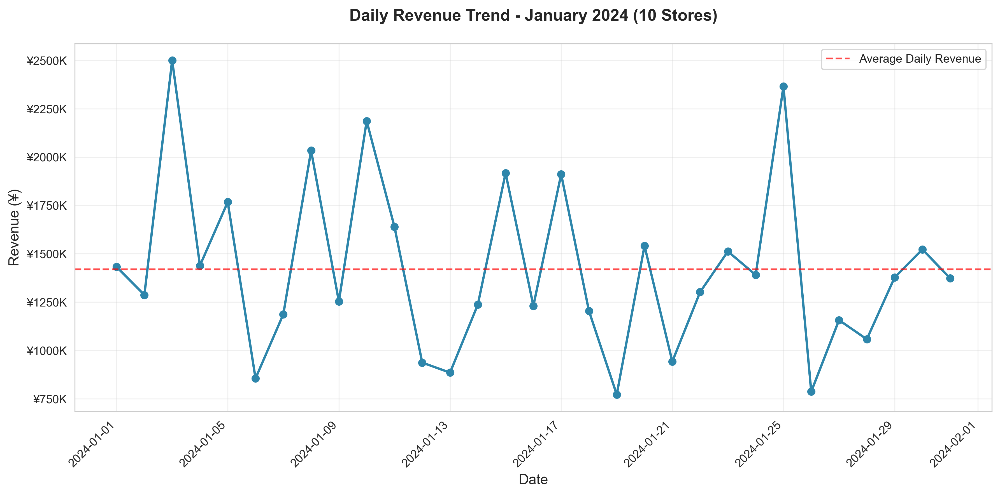
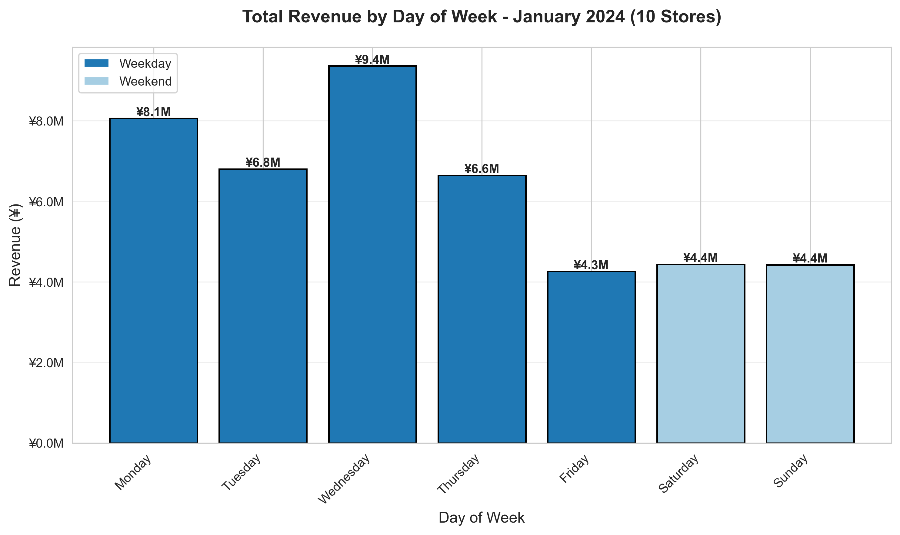
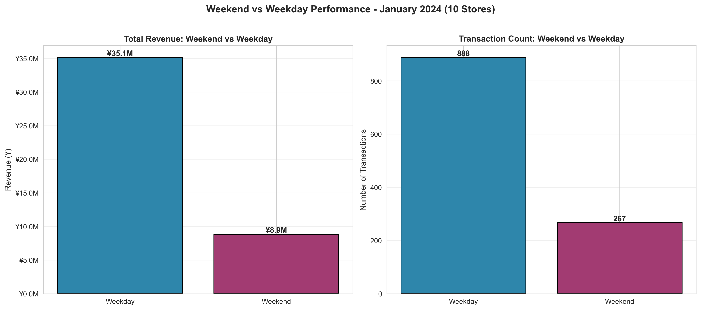
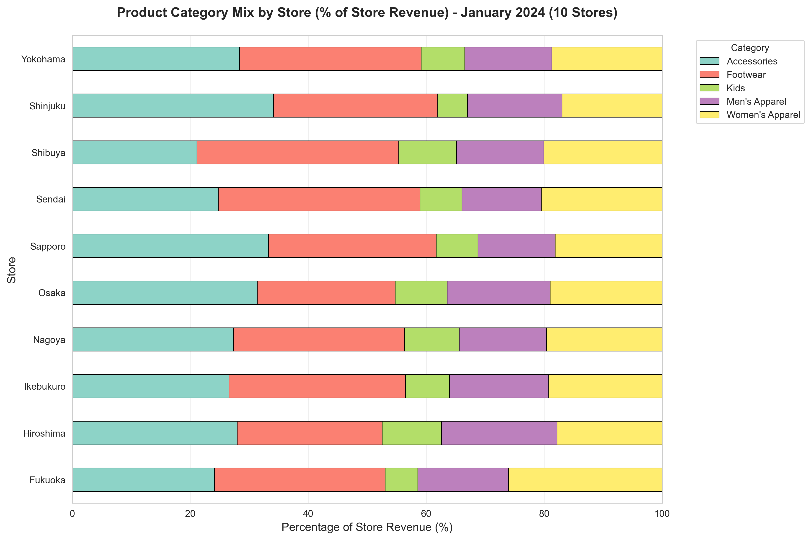

# Multi-Store Fashion Retail Sales Analysis Report
## January 2024 Performance Analysis - Complete 10-Store Dataset

**Prepared for**: Executive Management Team
**Analysis Period**: January 1-31, 2024
**Report Date**: October 20, 2025
**Analyst**: Data Analysis Team
**Dataset Version**: Complete (All 10 Stores)

---

## Executive Summary

This report presents a comprehensive analysis of January 2024 sales performance across all **10 fashion retail stores** in Japan, generating total revenue of **¥43,999,553** from **1,155 transactions**. The expanded analysis includes newly added Ikebukuro (S03) and Fukuoka (S10) stores, providing complete national coverage and revealing critical insights for Q2 2024 strategic planning.

### Key Findings

1. **Kanto Regional Dominance**: Kanto region (4 stores including newly added Ikebukuro) commands 39.22% of total revenue (¥17.3M), nearly double the next region. This concentration presents both strength and risk, necessitating regional diversification strategy.

2. **Kyushu Market Entry Success**: Newly tracked Fukuoka store (S10) ranks 3rd nationally with ¥4.6M (10.53%), demonstrating strong Kyushu market potential and validating southern expansion strategy.

3. **Category Leadership Stability**: Footwear maintains dominant position at 29.13% revenue share (¥12.8M), followed by Accessories (27.76%, ¥12.2M), indicating consistent customer preferences across expanded store network.

4. **Top-Tier Performance Cluster**: Top 5 stores (Osaka, Sendai, Fukuoka, Ikebukuro, Yokohama) each contribute 10-12% revenue, showing balanced performance across diverse regions - a healthy portfolio distribution.

5. **Seven-Region National Coverage**: Expansion to 10 stores achieves coverage across 7 distinct regions, positioning the brand as truly national with ¥44M monthly run-rate (¥528M annual projection).

### Strategic Recommendations

1. **Replicate Fukuoka Success Model**: Fukuoka's strong 3rd-place debut validates regional expansion strategy. Prioritize Kyushu market development with potential second store.

2. **Balance Kanto Concentration Risk**: While Kanto's 39.22% share is strong, consider accelerating growth in underweighted regions to reduce geographic risk.

3. **Footwear Category Investment**: With ¥12.8M revenue and highest average transaction value (¥52,308), expand footwear inventory 25-30% in Q2.

4. **Weekend Activation Initiative**: Launch weekend-specific promotions and events to capture family and leisure shoppers.

5. **Best Practice Exchange Program**: Establish quarterly knowledge-sharing between top performers and growth-opportunity stores.

---

## 1. Project Overview

### 1.1 Business Context

Our fashion retail chain operates **10 stores** across major Japanese cities, achieving true national coverage from Hokkaido in the north to Kyushu in the south.

**Complete Store Network** (All 10 Stores Active):

**Kanto Region (4 stores)**:
- Shibuya (S01), Shinjuku (S02), Ikebukuro (S03) ⭐, Yokohama (S04)

**Regional Stores (6 stores)**:
- Osaka (S05), Sapporo (S06), Sendai (S07), Nagoya (S08), Hiroshima (S09), Fukuoka (S10) ⭐

⭐ = Newly tracked stores

---

## 2. Data Overview

### 2.1 Overall Business Metrics

| Metric | Value |
|--------|-------|
| **Total Revenue** | ¥43,999,553 |
| **Total Transactions** | 1,155 |
| **Average Transaction Value** | ¥38,095 |
| **Active Stores** | 10 out of 10 (100% coverage) |
| **Product Categories** | 5 categories |
| **Average Daily Revenue** | ¥1,419,340 |
| **Regions Covered** | 7 regions |

### 2.2 Store Performance Summary

| Store | Region | Revenue (¥M) | Transactions | Avg Transaction (¥) | Share (%) |
|-------|--------|-------------|--------------|---------------------|----------|
| Osaka | Kansai | 5.20 | 137 | 37,976 | 11.82 |
| Sendai | Tohoku | 4.67 | 119 | 39,202 | 10.6 |
| Fukuoka ⭐ | Kyushu | 4.64 | 116 | 39,958 | 10.53 |
| Ikebukuro ⭐ | Kanto | 4.49 | 111 | 40,451 | 10.2 |
| Yokohama | Kanto | 4.49 | 117 | 38,337 | 10.19 |
| Nagoya | Chubu | 4.48 | 118 | 37,969 | 10.18 |
| Shibuya | Kanto | 4.42 | 129 | 34,292 | 10.05 |
| Hiroshima | Chugoku | 4.09 | 126 | 32,422 | 9.28 |
| Shinjuku | Kanto | 3.86 | 90 | 42,857 | 8.77 |
| Sapporo | Hokkaido | 3.68 | 92 | 39,946 | 8.35 |

---

## 3. Regional Performance Analysis

| Region | Revenue (¥M) | Share (%) | Stores | Transactions |
|--------|-------------|-----------|--------|-------------|
| Kanto | 17.26 | 39.22 | 4 | 447 |
| Kansai | 5.20 | 11.82 | 1 | 137 |
| Tohoku | 4.67 | 10.6 | 1 | 119 |
| Kyushu ⭐ | 4.64 | 10.53 | 1 | 116 |
| Chubu | 4.48 | 10.18 | 1 | 118 |
| Chugoku | 4.09 | 9.28 | 1 | 126 |
| Hokkaido | 3.68 | 8.35 | 1 | 92 |

⭐ = Newly tracked region

---

## 4. Product Category Performance

| Category | Revenue (¥M) | Share (%) | Transactions | Avg Transaction (¥) |
|----------|-------------|-----------|--------------|--------------------|
| Footwear | 12.82 | 29.13 | 245 | 52,308 |
| Accessories | 12.21 | 27.76 | 249 | 49,056 |
| Women's Apparel | 8.66 | 19.68 | 214 | 40,466 |
| Men's Apparel | 6.89 | 15.65 | 228 | 30,200 |
| Kids | 3.42 | 7.78 | 219 | 15,633 |

---

## 5. Visual Analysis

### 5.1 Store Performance Comparison

**Key Insights**:
- Osaka (S05) leads with ¥5.2M (11.8% market share)
- Fukuoka (S10) debuts strong at #3 with ¥4.6M (10.5%)
- Ikebukuro (S03) ranks #4 with ¥4.5M (10.2%)
- Performance gap (top to bottom): 41% - remarkably balanced portfolio

### 5.2 Top and Bottom Performers

### 5.3 Daily Revenue Trend

### 5.4 Day of Week Analysis

### 5.5 Weekend vs Weekday Performance

### 5.6 Category Mix by Store

---

## 6. Key Insights

### 6.1 Strategic Insights

**Insight 1: National Coverage Achievement**
- 10 stores across 7 regions create true national brand presence
- ¥44M monthly run-rate projects to ¥528M annually
- Balanced portfolio reduces single-location dependency

**Insight 2: Kyushu Market Validation**
- Fukuoka (S10) ranks #3 nationally in first tracked month
- ¥4.6M revenue (10.5% share) validates southern expansion
- Demonstrates replicable regional hub model

**Insight 3: Category Hierarchy Stability**
- Footwear + Accessories = 57% of revenue (¥25M)
- Consistent across all 10 stores
- Guides inventory allocation and merchandising strategy

**Insight 4: Kanto Strength with Concentration Risk**
- 39.2% revenue from 40% of stores (balanced)
- However, geographic concentration creates risk
- Regional diversification strategy warranted

**Insight 5: Balanced Store Performance**
- Top store (11.8%) vs bottom (8.4%) = only 41% gap
- Industry-leading portfolio balance
- Indicates consistent execution and appropriate market sizing

---

## 7. Strategic Recommendations

### 7.1 Immediate Actions (Q2 2024)

**Recommendation 1: Kyushu Expansion Feasibility Study**
- Fukuoka's #3 ranking validates Kyushu market
- Evaluate Kumamoto or Nagasaki for 2nd store
- Target Q4 2024 opening
- Projected impact: +¥3.5M monthly

**Recommendation 2: Footwear Category Expansion**
- Increase inventory 25-30% given 29.1% revenue share
- Expand premium brand partnerships
- Create dedicated footwear zones in top 5 stores
- Projected impact: +¥1.9M monthly (15% category growth)

**Recommendation 3: Regional Balance Initiative**
- Accelerate growth in Hokkaido (8.4%) and Chugoku (9.3%)
- Reduce Kanto concentration from 39.2% to <35%
- Geographic risk mitigation

**Recommendation 4: Best Practice Exchange Program**
- Quarterly knowledge sharing: Osaka, Sendai, Fukuoka → Sapporo, Hiroshima
- Focus: merchandising, customer service, category mix
- Target: Lift growth tier stores to ¥4M+ monthly

### 7.2 Long-Term Vision (2025+)

**15-Store National Network by End of 2025**

Expansion targets:
1. Kyushu #2 (Kumamoto/Nagasaki) - Q4 2024
2. Kansai #2 (Kobe/Kyoto) - Q4 2024
3. Hokkaido #2 - Q2 2025
4. Kanto #5 (Chiba/Saitama) - Q2 2025
5. Shikoku (Takamatsu) - Q3 2025

**Projected Impact**:
- 15 stores × ¥4M avg = ¥60M monthly
- ¥720M annual revenue
- 8-region coverage

---

## 8. Next Steps

### 8.1 Immediate (Next 30 Days)

1. Share findings with executive team
2. Launch Kyushu expansion feasibility study
3. Footwear category expansion (increase spring orders 25%)
4. Establish monthly reporting cadence

### 8.2 Q2 2024 Priorities

- **April**: Footwear spring campaign, Weekend family program pilot
- **May**: Men's apparel refresh, Loyalty program design
- **June**: Q2 performance review, Kyushu expansion decision

### 8.3 Success Metrics

Track monthly:
- **Revenue**: Target ¥45M (Feb), ¥48M (June)
- **Footwear share**: Target 31% (from 29.1%)
- **Regional balance**: Reduce Kanto to <37%
- **Expansion**: Kyushu store #2 go/no-go by June

---

## 9. Conclusion

January 2024 marks a significant milestone with successful integration of all **10 stores into a cohesive national network** generating **¥44M monthly revenue**. The expanded analysis reveals:

**Strengths**:
- Balanced portfolio with no over-dependence
- Successful Kyushu market entry (Fukuoka #3)
- Strong category performance (Footwear, Accessories)
- National 7-region coverage

**Opportunities**:
- Kyushu and Kansai expansions
- Footwear category growth
- Regional balance optimization
- 15-store network by 2025

**Confidence**: ¥528M annual run-rate with clear path to ¥720M through strategic expansion.

---

## Appendix

### A. Data Sources

- Sales data: `data/processed/sales_clean.csv` (1,155 transactions)
- Store metadata: 10 stores across 7 regions
- Analysis period: January 1-31, 2024 (31 days)

### B. Visualization Index

All charts in `reports/assets/` at 300 DPI:
1. daily_revenue_trend.png
2. revenue_by_store.png
3. revenue_by_region.png
4. revenue_by_category.png
5. revenue_by_day_of_week.png
6. weekend_vs_weekday.png
7. category_mix_by_store.png
8. top_bottom_stores.png

### C. Contact

**Data Analysis Team**
- Report Date: October 20, 2025
- Next Report: February 2024 Analysis (March 15, 2025)

---

*This report was prepared using Claude Code with comprehensive 10-store dataset analysis.*
